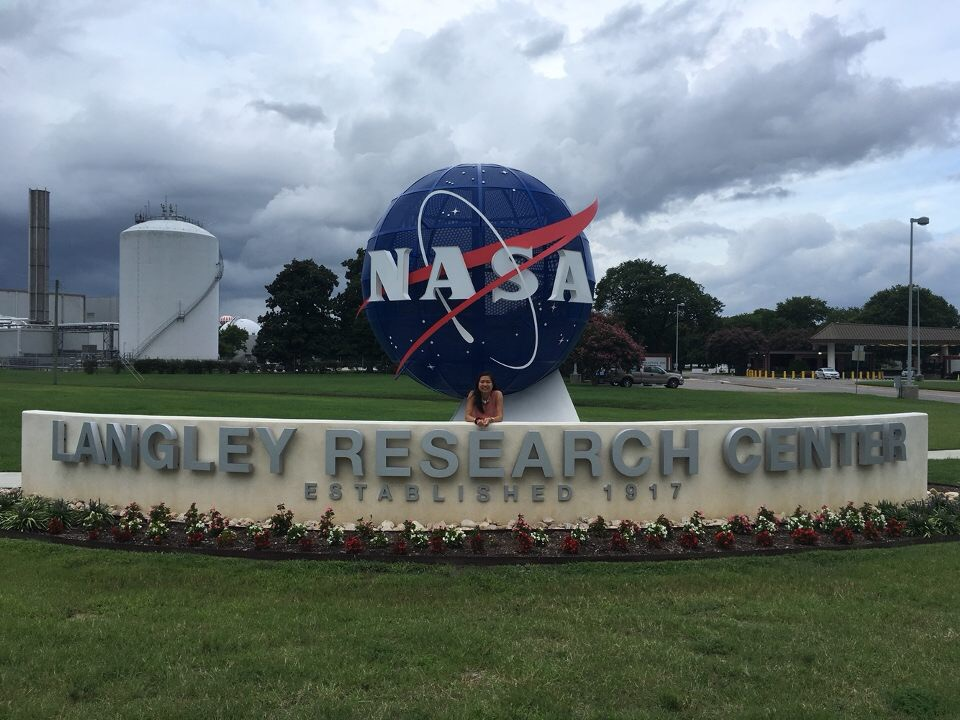
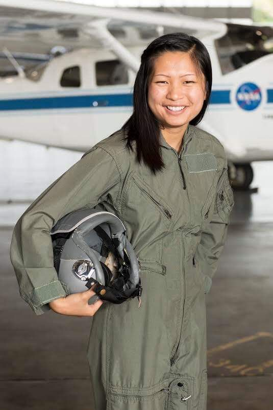
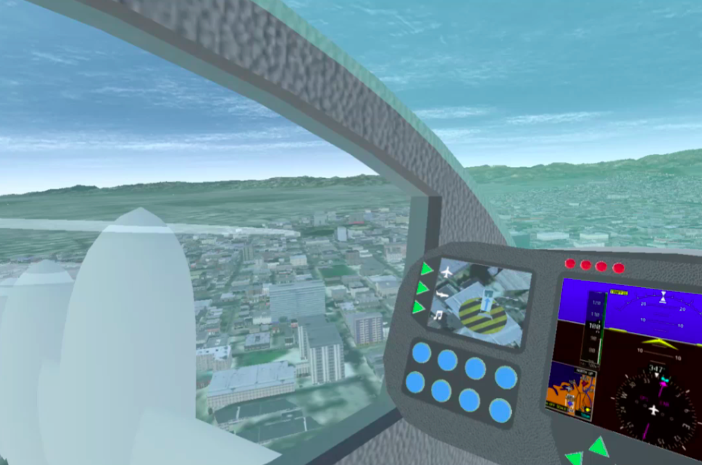
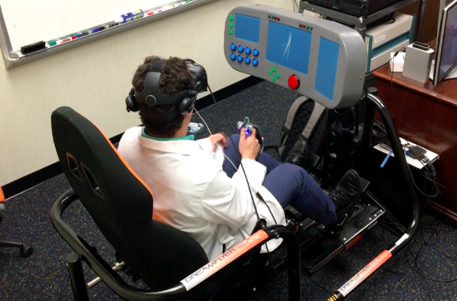

**NASA Langley Research Center** - Urban Air Mobility Pilot-Training Simulator NASA Academy Research Associate (NASA Leadership Program)

**Dates:** 08/2018 – 12/2018

**Research Project:** Urban Air Mobility Vehicle Simulations in Both Traditional and Mixed Reality Simulators
Abstract: The 2018 NASA Academy at Langley Research Center created proof-of-concept mixed reality (MR) and traditional simulators to enable quick vehicle concept prototyping and data collection for human factors studies. Urban Air Mobility (UAM) vehicle concepts were implemented as the focus for these simulators due to recent and dramatic rise in subject interest. The team used X-Plane 11 to model flight dynamics, and Unity for the virtual reality (VR) aspect of the MR simulator and to model the control panel in the traditional simulator. A physical version of the virtual control panel was also fabricated to provide haptic feedback to maintain the immersion for the MR simulator.

**Personal Tasks:**
- Worked in a multidisciplinary, diverse engineering team tasked to build a virtual reality Dell HTC Vive program using both Unity and X-Plane to integrate users into a piloting role for UAM flight
- Used online geographical databases and applications developed with C# scripts to build virtual reality city environments and terrain based on real-world cities, and implemented weather for simulated emergency piloting events to aid in the research of UAM pilot behavior
- To maximize human-user interface, paired virtual reality with a 3D-printed aircraft control panel and mechanical flight simulator chair to fully immerse the user into a mixed-reality simulator booth

**Language:** C#

**Hardware/Software:** HTC Vive, LEAP Motion, Esri CityEngine, Unity, Blender

