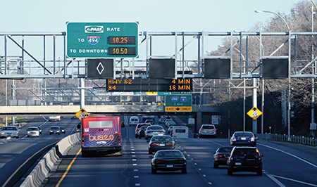
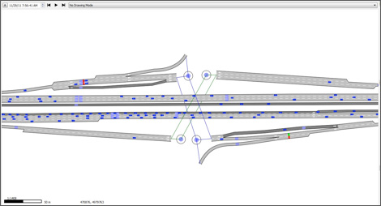

**Minnesota Traffic Observatory** - Undergraduate Research Assistant

**Dates:** 01/2017 – 05/2017

**Research Project:** Evaluation of the Effect MnPASS Lane Design has on Mobility and Safety
  
**Abstract:**

High-occupancy vehicle (HOV) and high- occupancy toll (HOT) lanes are restricted-use freeway lanes reserved for vehicles with more than oneoccupant, or equipped to charge single-occupant vehicles (SOVs) for using the facility. The goal of HOV/HOT combination lanes is to reduce congestion by promoting ride sharing while better utilizing the facility by allowing SOV's that pay the toll.

The Minnesota Department of Transportation has so far constructed two such facilities (MnPASS on the median lanes of I-394 and I-35W freeways) and has plans for more. The existing facilities have substantially different access control designs with no concrete evidence which is the most appropriate design for a given geometry and demand.

In this project, which evaluated the safety and mobility of Minnesota’s MnPASS lanes, MTO researchers found that facilities on I-35W (open access) and I-394 (restricted access) are performing equally well in spite of their different designs.
To evaluate the two designs, the researchers collected video data and examined lane changes in areas where drivers are allowed to access MnPASS lanes on both 394 and 35W. The team then identified and analyzed shockwaves—areas of suddenly stopping or slowing traffic— to help them measure mobility and safety.

How often shockwaves occurred was correlated to mobility, since shockwaves disrupt the good service and high speeds drivers expect in MnPASS lanes. Shockwave length was used to evaluate safety—the more vehicles that have to unexpectedly slow down or stop, the higher the likelihood of a crash. Results indicate that shockwave activity is similar between the two systems.

**Tasks:**
- Built MATLAB programs to analyze transportation PostgreSQL data from sensors on Interstate-35 and created an algorithm topredict an upcoming crash by analyzing real-time speeds of vehicles
- Developed Python code for the Minnesota Department of Transportation to process real-time vehicle speeds and warn cars to slow down via electric road signs to prevent a predicted crash on Minnesota’s highest crash point at Interstate-35

